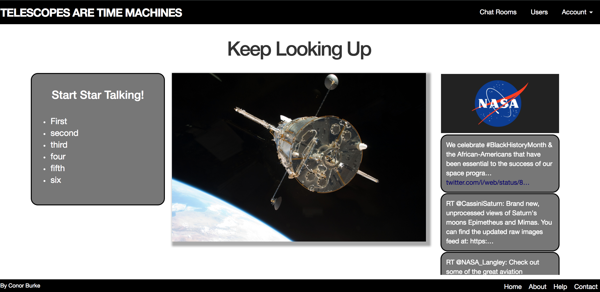
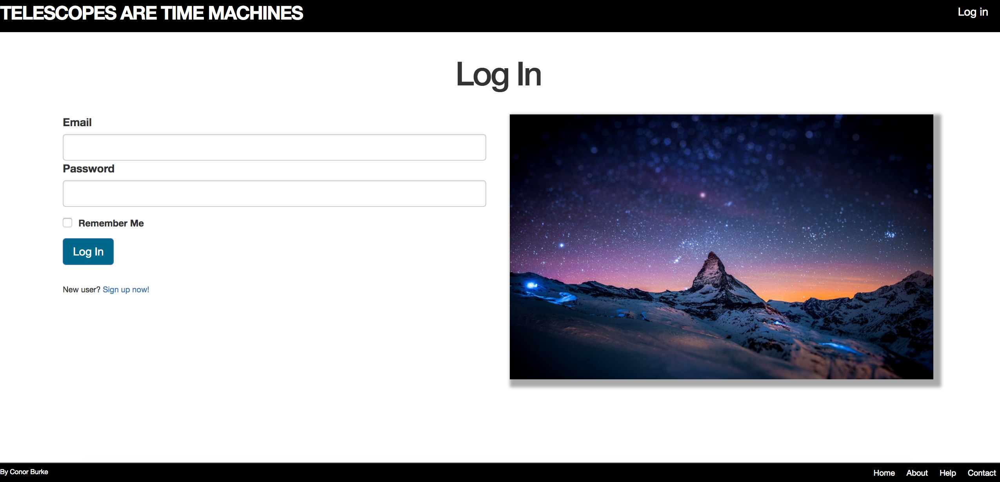
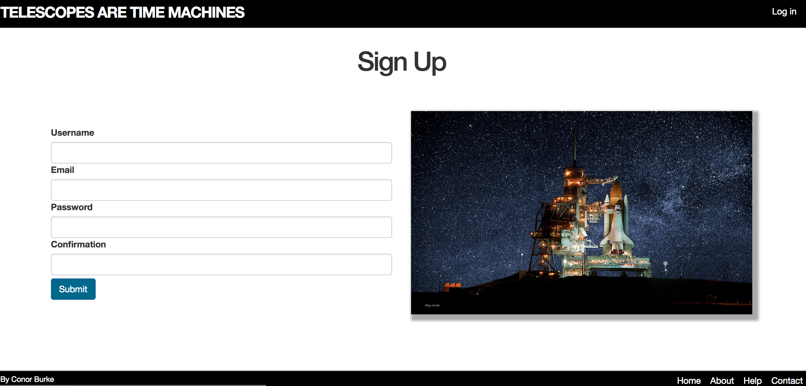
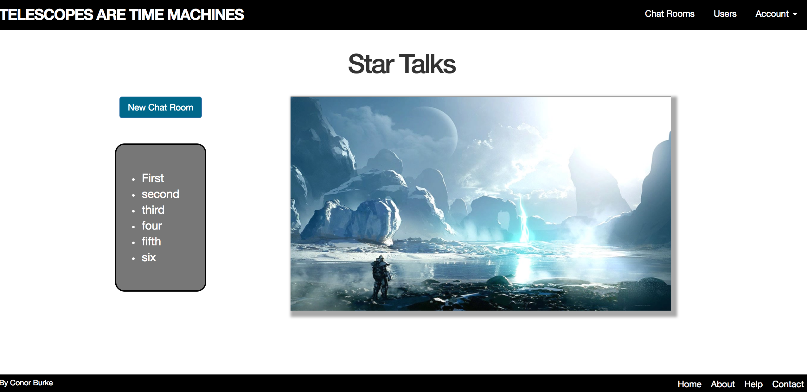
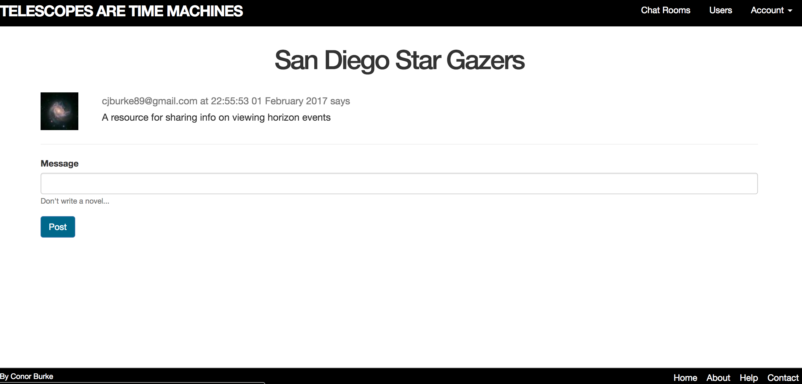

#Telescopes are Time Machines
[](https://travis-ci.org/conorburke/Telescopes-are-Time-Machines)

[Website](https://telescopesaretimemachines.herokuapp.com)

##What is Telescopes are Time Machines?

This application is dedicated to keeping users up to date on astronomy news both on a local and national level.  It currently feeds the NASA twitter and additionally enables live chat between users in order to facilitate the passing of local astronomy news.  This can include things such as areas to view a meteor shower or the time of a solar eclipse, but is really only limited to the amount of user interaction and information sharing.

##Contributing

- [Conor Burke](https://github.com/conorburke)

##Configuration and Dependencies

* Rails version: 5.0.1
* Ruby version: 2.3.1
* Deployment Server: Heroku
* Database: PostgreSQL v9.5.5 on x86_64-apple-darwin15.6.0
* Test Suite: RSpec (rspec-rails v3.5)
* Security: Self built utilizing Rails helper methods
* Chat Server Development: Redis v3.2 
* Chat Server Production: RedisCloud
* Twitter API
* ActionCable for Chat Rooms

##Download

* Clone: git clone https://github.com/conorburke/Telescopes-are-Time-Machines.git

##Developing
To contribute towards SeeSpotGo, clone the repository, navigate to the directory, and follow these steps: 

Install all gem dependencies: 
```
bundle install
```
Create and populate the database:
```
rails db:create
rails db:migrate
```
Start the local server and navigate to `http://localhost:3000` in your browser:
```
rails s
redis-server
```
Manage the database: 
```
rails c
```

###Homescreen


###Log In


###Sign Up


###Chat Room Main


###Individual Chat Room
